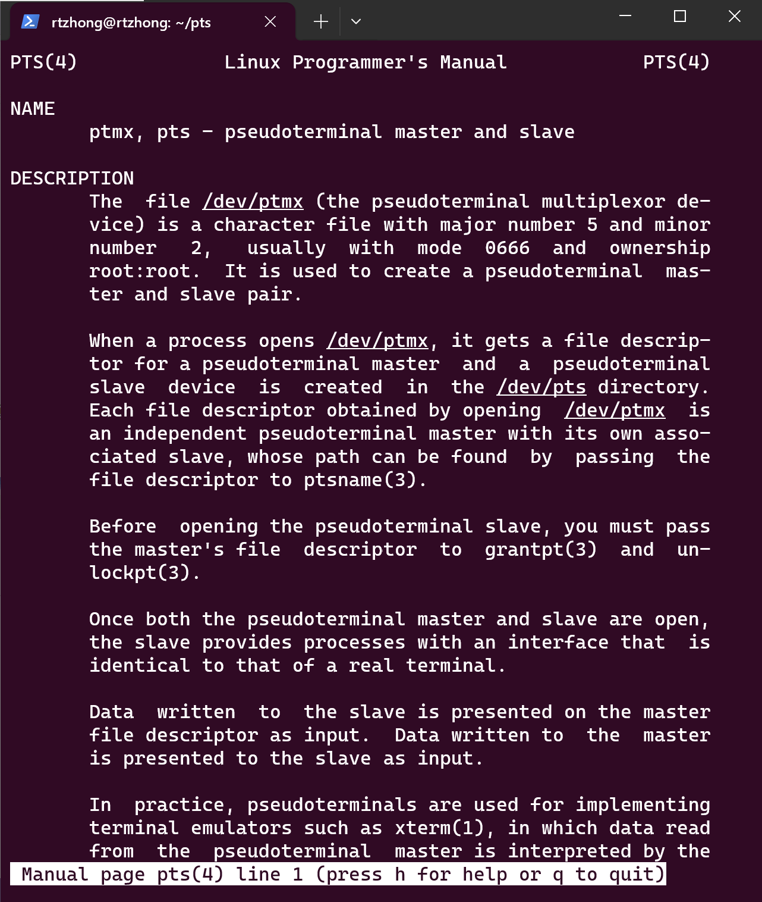

{}

## 概览

在Web领域有一个比较常见的问题:浏览器地址栏输入网址后具体发生了什么？这个问题把网络、浏览器、HTTP、TCP等知识都给包含了，而且还能根据回答作进一步的追问。

那么，在Linux中有没有类似的问题？我构造了一个类似的问题："在`Linux`终端中按下Ctrl-C后具体发生了什么？"，并对这个问题做出了一定程度上的解答。在我看来，这个问题同样涉及到不少方面：Linux的`pgid(Process Group ID)`、`sid(Session ID)`、Shell、相关系统调用、进程等内容都需要有所了解。

本文先介绍了对这一问题的一种比较模糊的解答，然后再介绍理解这个问题需要的一些知识，再大致介绍按下Ctrl-C后发生的事情。最后，通过一些演示程序加深对其中一些细节的理解。


## 模糊的解答

运行下面的无限循环，linux终端就好像卡在那里，按键盘Ctrl+C后程序就可以退出，在`Linux`终端中按下Ctrl-C后具体发生了什么？
```bash
$ gcc foo.c && ./a.out
```

```c
int main(){
  while(1)
  ;
}
```

可以进行粗略地猜测，按下Ctrl-C这个瞬间，键盘应该发起了一次中断的请求，操作系统识别到是Ctrl-C后将这个信息以某种方式传送到我们正在运行程序的进程，收到这个信息后，进程终止退出。

问题来了，操作系统怎么向进程传递这个信息的？如果懂一些Linux的信号机制（`signal(7)`），那么就知道OS通过将信号递送到进程来实现信息的传递。

也就是说大概操作系统将键盘中断转换为递送到进程的信号,如果进程没有注册相关的处理函数，就会在信号的作用下退出（中断->操作系统在进程相关的数据结构上标记信号->再次调度该进程时进入信号处理的相关流程）。

在研究这个问题时，我的认识也就停留在这种程度，但还是有疑问：按下Ctrl+C后，操作系统怎么知道向哪一个进程递送这样一个信号？比如说，在Linux中开了多个窗口，在某个窗口下按下Ctrl+C后，操作系统是怎样将相关信号递送到当前窗口下正在运行的程序？

## 前置知识


更详细的信息可以参考credentials(7)
### Process Group 和 Session
> Sessions  and  process groups are abstractions devised to support shell job control.

从文档中可以看出sessions和proces groups都是为了支持shell job control（作业控制）.

同一个进程组中的所有进程都有同一个process group id(`pgid`)，shell每次运行一条命令/一个程序的时候都会创建一个新的进程组（如何创建请看下文）。当进程的pid和pgid相等的时候，该进程就是进程组的领头进程（process group leader）。当一个信号发送给进程组的时候（通过kill等系统调用），所有进程组内的进程都会收到该信号。


> `setsid(2)`: If a session has a controlling terminal, and the CLOCAL flag for that terminal is not set, and a terminal hangup occurs, then the session leader is sent a SIGHUP signal.If a process that is a session leader terminates, then a SIGHUP signal is sent to each process in the foreground process group of the controlling terminal.  

同一个Session中的进程具有相同的session ID。此外规定，一个进程组中的所有的进程都具有相同的session ID（如何保证这个要求请看下文），因此可以认为，session和process group有着1:n的关系，一个session可能对应多个process group，一个process group对应一个session group。

当进程的pid和进程所在session的sid相同时，该进程就是该session的领导（session leader）。如果一个session当中的session leader结束，那么所有和控制终端关联的前台进程组都会发送一个SIGHUP信号。有趣的是，可以从上面的文档中可以看出SIGHUP信号的一些历史渊源，它与（物理的）terminal卡住有关。

在不进行特别配置的情况下，向shell所在进程发送SIGUP也会使得包括在后台运行的进程退出，根据bash(1)文档，这是因为在退出的时候shell还会向所有作业发送SIGUP，这相当于bash在OS的基础上又多做了一些工作。

> `bash(1)`: The shell exits by default upon receipt of a SIGHUP.  Before exiting, an interactive shell resends  the  SIGHUP  to  all jobs,  running  or stopped.  Stopped jobs are sent SIGCONT to ensure that they receive the SIGHUP.  To prevent the shell from sending the signal to a particular job, it should be removed from the jobs table with the disown builtin (see SHELL BUILTIN COMMANDS below) or marked to not receive SIGHUP using disown -h.


### `pgid`和`sid`


> `credentials(7)`: A child created by fork(2) inherits its parent's  session ID and process group ID.  A process's session ID and process group  ID  are  preserved  across  an  execve(2). Sessions  and  process groups are abstractions devised to support shell job control.  

pgid（Process Group ID）进程组ID用于区分不同的进程组，当调用`fork()`的时候，父进程和子进程的pgid相同.

foo.c:
```c
#include <sys/types.h>
#include <unistd.h>

int main() {
  int ret = fork();
  while (1)
    ;
}
```
运行：

```bash
./a.out & # running in background
ps -o comm,pgid,sid,pid,ppid
COMMAND            PGID     SID     PID    PPID
bash                519     519     519     518
a.out               867     519     867     519
a.out               867     519     868     867
ps                  870     519     870     519

```
这里a.out中执行了一次fork，a.out对应的pgid都是867，注意到a.out的pgid和bash(也就是Shell)对应的pgid不一样,也印证了上文提到的"shell每次运行一条命令/一个程序的时候都会创建一个新的进程组".


#### 如何改变`pgid`

有一个系统调用`int setpgid(pid_t pid,pid_t pgid)`可以改变setpgid这个要求，该调用将进程号为pid的进程的进程组号修改为pgid,
如果pid等于零，则默认将调用该函数的进程的进程组号改为pgid。

该调用将进程从一个进程组移动到另外一个当中，需要满足两个进程组在同一个session当中，这样限制以后满足了同一个进程组的进程必定在同一个session当中这个之前提到的*约束条件*。

`setpgid()`示例程序(这有助于理解bash在新进程启动一个程序之前是怎么样改变它的pgid)：
```c
#include <stdio.h>
#include <stdlib.h>
#include <sys/types.h>
#include <unistd.h>
int main() {
  int ret = fork();
  if (ret == 0) {
    printf("child process pid:%d pgid:%d\n", getpid(), getpgid(0));
    if (setpgid(0, 0)) {
      perror("setpgid");
      exit(EXIT_FAILURE);
    }
    printf("child process pgid:%d\n", getpgid(0));

    exit(EXIT_SUCCESS);

  } else {
    printf("parent process pid:%d pgid:%d\n", getpid(), getpgid(0));
    exit(EXIT_SUCCESS);
  }
}
```
程序输出：
```bash
$ ./a.out
parent process pid:1262 pgid:1262
child process pid:1263 pgid:1262
child process pgid:1263
```

#### 如何改变`sid`

通过系统调用`pid_t setsid(void)`可以改变当前进程的session id，
它要求当前进程不是所在进程组的leader（group leader process），它会使得该进程位于一个新的进程组当中（进程组号为该进程的pid），同时也把它移动到一个新的session当中（session id为该进程的pid）。最后该session初始时不与任何控制终端相关联（controlling terminal，下文会介绍）。

`setsid()`示例程序

```c
#include <stdio.h>
#include <stdlib.h>
#include <sys/types.h>
#include <unistd.h>
int main() {
  int ret = 0;

  ret = setsid();
  if (ret) {
    puts("expected to fail");
  }

  ret = fork();
  if (ret) {
    exit(EXIT_SUCCESS);
  } else {
    printf("sid:%d pid:%d pgid:%d before setsid\n", getsid(0), getpid(),
           getpgid(0));
    ret = setsid();
    if (ret == -1) {
      perror("setsid");
      exit(EXIT_FAILURE);
    }
    printf("sid:%d pid:%d pgid:%d after setsid\n", getsid(0), getpid(),
           getpgid(0));
    exit(EXIT_SUCCESS);
  }
}
```
输出结果
```bash
$ ./a.out
expected to fail
sid:969 pid:2073 pgid:2072 before setsid
sid:2073 pid:2073 pgid:2073 after setsid
```


### 终端(Terminal) / `tty`

很久以前，tty是有物理存在的，可以参考知乎上的[看得见摸得着的TTY——电传打字机](https://zhuanlan.zhihu.com/p/108206742)

到了现代，已经没有物理上的tty了，往往是软件模拟出来的tty（和图形显示配合），如下图。为了降低理解的复杂性，作为tty的用户，我们仍然可以将tty看作是物理设备，而不用去管模拟的实现。如果要深究其中的原理，pts(4)是一个比较好的起点。



* 查看当前tty的命令

可以通过tty命令
```bash
$ tty
/dev/pts/2
```

也可以通过readlink命令(tty命令实际上就是这样实现的)
```bash
$ readlink /proc/self/fd/0
/dev/pts/0
```

从上面可以看出，程序中的stdin对应的时/dev/pts/0这个伪终端，可以手动对这个伪终端进行输入输出：

```bash
$ echo hello world >> /dev/pts/0
hello world
```

也可以打开两个终端，在其中一个终端(`/dev/pts/0`)输入：
```bash
 echo hello world >> /dev/pts/1
```
在另外一个终端(`/dev/pts/1`)就可以看到相应的输出。

### 终端和进程的关系

在以前，一台电脑有多个用户，每个用户使用一台（物理存在的）terminal共享一台电脑。现在，打开多个命令行窗口，逻辑上
每个命令行窗口都是一个terminal（软件上模拟的）。

在Linux当中，有个Controlling Terminal（控制终端）的概念，一个session group对应一个terminal/tty，当然一个session group 也可能没有对应的控制终端（比如刚成功调用`setsid()`的进程）。具体在kernel里面这样的关系在数据结构上的表达方式，可以参考 [Is it the process that has a controlling terminal, or is it the session that has a controlling terminal?](https://unix.stackexchange.com/questions/405755/is-it-the-process-that-has-a-controlling-terminal-or-is-it-the-session-that-has)

> Internally in Linux, things are slightly more complex. Each `task_struct` has a set of pointers to pid structures for its `process group ID` and `session ID`; and has another pointer to a per-process `signal_struct` structure that in turn directly points to the tty structure of the controlling terminal.

由于一个controlling terminal对应一个session group，两者绑定在一起，当controlling terminal有信息需要传递时（比如键盘输入），terminal就大概知道要往哪个session group发送。但这样并不准确，同一个session group中可能有后台运行的程序，信号或标准输入的信息肯定不能向整个session group发送，只希望当前向用户"看到"的程序发送（前台？），因此引入了前台进程组的概念（foreground process）。


怎样将终端和一个session group绑定？

很显然，这需要对像/dev/pts/0这样设备文件进行操作，设置其session group。根据ioctl_tty(2)：

> `ioctl_tty(2)`: [TIOCSCTTY int arg]  Make the given terminal the controlling terminal of the calling process.  The calling process must be  a  session leader and not have a controlling terminal already.  For this case, arg should be specified as zero.**If  this  terminal  is  already  the controlling terminal of a different session group, then the ioctl fails with EPERM, unless the caller has the CAP_SYS_ADMIN capability and arg equals 1, in which case the terminal is stolen, and all processes that had it as controlling terminal lose it.**

因此`ioctl(fd,TIOCSCTTY,1)`这个调用就能够将fd对应的terminal的session设置为当前进程所在的session（从其它session抢过来）。

### 前台进程组(foreground process group)


前台进程组与其所在session的控制终端绑定，也就是说一个控制终端对应一个session，也对应着这个session内的一个进程组（前台进程组）。当terminal要发一个信号的时候，也就发给它所绑定的前台进程组，"前台"这个概念也与我们认知相符合，因为按下Ctrl+C的时候，我们并不希望向"后台"程序发信号，即使它们和前台程序都在一个session内。

那么前台进程组可以通过ioctl或libc的函数tcsetpgrp来对相应的terminal进行操作，根据`tcsetgrp(3)`

> ` tcsetgrp(3)`: The function tcsetpgrp() makes the process group with process group ID pgrp the foreground process group on the terminal associated  to  fd, which must be the controlling terminal of the calling process, and still be associated with its session.  Moreover, pgrp must be a (nonempty) process group belonging to the same session as the calling process. **If tcsetpgrp() is called by a member of a background process group in its session, and the calling process is not blocking or ignoring SIGTTOU, a SIGTTOU signal is sent to all members of this background process group.**

设置的前台进程组所在的session id必须与controlling terminal对应的session id相同，通过tcsetpgrp等函数就可以切换某个controlling terminal 对应的前台程序。


## 按下Ctrl-C后发生了什么？

通过上面的前置知识，可以将按下Ctrl-C后发生的事情描述得更细致。

假设我们打开一个终端，进入到Bash的界面，假设终端对应的设备文件路径为/dev/pts/0，可以想来，系统或Bash应该做了一些初始化：/dev/pts/0 终端（Controlling Terminal）所对应的session是Bash所在的session group，对应的foreground process group 应该是bash进程所在的process group。

当我们输入程序名并运行该程序时，bash会帮我们创建一个新的进程，并且将新进程放入一个新的的pgid中(`setpgid(0,0)`可以实现这一点，但我还未验证bash是怎样实现的)，然后将新进程所在进程组设置为前台进程。

由于现代系统都是伪终端，键盘的中断可能经历了复杂的流程才能转换为伪终端的相关行为，因此，这里将终端视作几十年前的物理终端，并省略了特殊情况。

当按下Ctrl-C的时候，键盘（终端）发起中断，操作系统根据该终端的数据结构找到该终端对应的前台进程组,向所有进程组中的进程发送SIGINT信号，如果前台进程组的进程没有注册SIGINT的信号处理函数，那么该进程终止。


## "隔山打牛"

为了更好地理解上面的内容，我写了一个程序。

打开两个terminal，在其中一个terminal运行下面的程序（该程序假定另外一个terminal的tty为/dev/pts/3，可以根据实际情况修改源代码，比如说改成/dev/pts2 ）,当在另外一个窗口按下Ctrl+C的时候，运行程序的窗口的SIGINT信号处理函数就会打印`receive SIGINT`,退出。

这个程序也验证了terminal不会向不属于前台进程组的进程发送信号。
{}
需要以root用户的身份运行
{}

```c 
#include <fcntl.h>
#include <signal.h>
#include <stdio.h>
#include <stdlib.h>
#include <sys/ioctl.h>
#include <sys/types.h>
#include <unistd.h>
#include <wait.h>
void sigint_handler(int sig) {
  printf("receive SIGINT\n");
  exit(EXIT_SUCCESS);
}

int main() {

  int ret = fork();
  if (ret == -1) {
    perror("fork");
    exit(EXIT_FAILURE);
  }
  if (ret != 0) {
    exit(EXIT_SUCCESS);
  }
  struct sigaction act;
  act.sa_sigaction = NULL;
  act.sa_flags = 0;
  act.sa_handler = sigint_handler;
  sigemptyset(&act.sa_mask);

  ret = sigaction(SIGINT, &act, NULL);
  if (ret) {
    perror("sigaction");
    exit(EXIT_FAILURE);
  }

  printf("old session id:%d parent pid:%d\n", getsid(0), getppid());

  pid_t new_session_id = setsid();
  if (new_session_id == -1) {
    perror("setsid");
    exit(EXIT_FAILURE);
  }
  printf("new session id:%d\n", new_session_id);

  printf("process id:%d\n", getpid());

  int buf[100];
  char terminal[] = "/dev/pts/3";
  int fd = open(terminal, O_RDONLY);

  if (fd == -1) {
    perror("open");
    exit(EXIT_FAILURE);
  }
  // meaningless,just to show the usage
  ret = ioctl(fd, TIOCSCTTY, 1);
  if (ret != 0) {
    perror("ioctl");
    exit(EXIT_FAILURE);
  }

  puts("successfully get the controlling terminal\n");
  pid_t foreground_pgid = tcgetpgrp(fd);
  printf("foreground pgid %d cur pgid %d\n", foreground_pgid, getpgid(0));
  pid_t p = getpid();
  ret = ioctl(fd, TIOCSPGRP, &p);
  if (ret != 0) {
    perror("ioctl");
    exit(EXIT_FAILURE);
  }
  ret = fork();
  if (ret) {
    if (tcsetpgrp(fd, ret)) {
      perror("tcsetpgrp");
      exit(EXIT_FAILURE);
    }
    wait(NULL);
    // not equal(expected)
    printf("current foreground pgid:%d current process pgid:%d\n",
           tcgetpgrp(fd), getpgid(0));
    printf("child return\nparent process enter endless loop\n");
    // can not send SIGINT from another terminal,because foreground process
    // group is not the current process group.
    while (1)
      ;
  }
  setpgid(0, 0);
  printf("child foreground pgid %d cur pgid %d\n", tcgetpgrp(fd), getpgid(0));
  printf("Now in %s\n", terminal);

  while (1) {
    sleep(1);
    printf("continue...\n");
  }

  return 0;
}
```

## Discussion

还是有一些地方没有了解得太清楚：

* Bash 的具体实现是怎么样的？
* 键盘中断的处理流程了解还得不够深入.

## Resources and References

* [终端、Shell、tty 和控制台（console）有什么区别？](https://www.zhihu.com/question/21711307/answer/118788917)
* [Linux session(会话)](https://www.cnblogs.com/sparkdev/p/12146305.html)
* [Linux ps命令常见实战用法](https://zhuanlan.zhihu.com/p/117630970)
* [ioctl_tty(2)](https://www.man7.org/linux/man-pages/man4/tty_ioctl.4.html)
* [credentials(7)](https://www.man7.org/linux/man-pages/man7/credentials.7.html)
* [tcsetpgrp(3)](https://www.man7.org/linux/man-pages/man3/tcsetpgrp.3.html)
* [pts(4)](https://www.man7.org/linux/man-pages/man4/pts.4.html)
* [What is the purpose of the controlling terminal?](https://unix.stackexchange.com/questions/404555/what-is-the-purpose-of-the-controlling-terminal#:~:text=With%20controlling%20terminal%2C%20process%20is%20able%20to%20tell,e.g.%2C%20Ctrl-C%2FCtrl-%26%5D%20to%20terminate%20the%20foreground%20process%20group.)