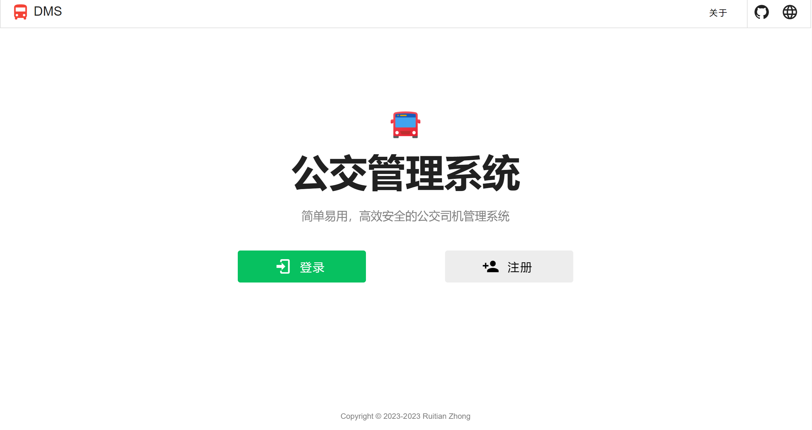
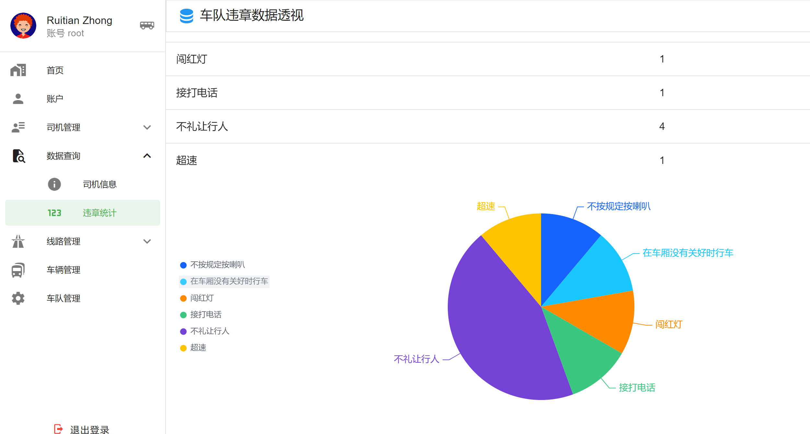
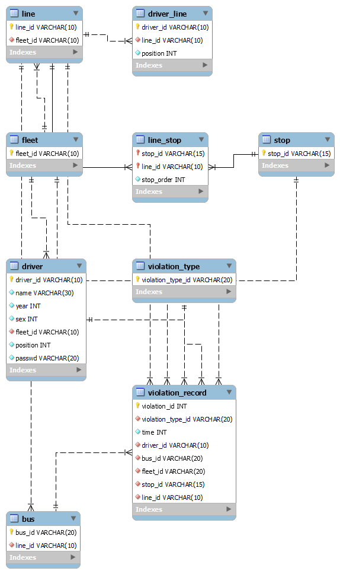

Driver Management Front End([dmfe](https://github.com/ruitianzhong/dmfe)) and Driver Management Back End([dmbe](https://github.com/ruitianzhong/dmbe)) are the front end and back end for the bus driver management system respectively, which is the final project for *Database System* (Fall 2023) in Xidian University.

## Demo

