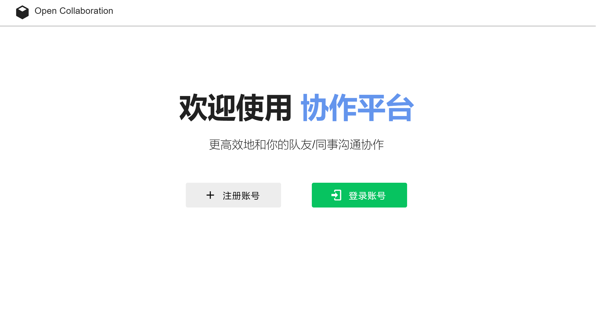
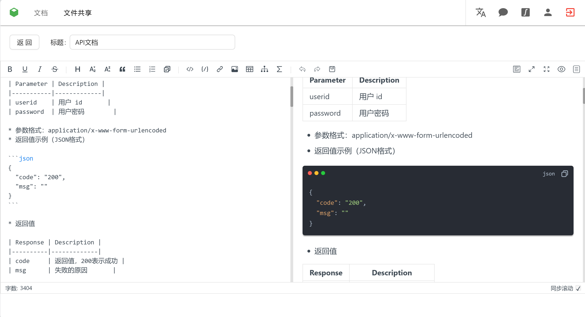
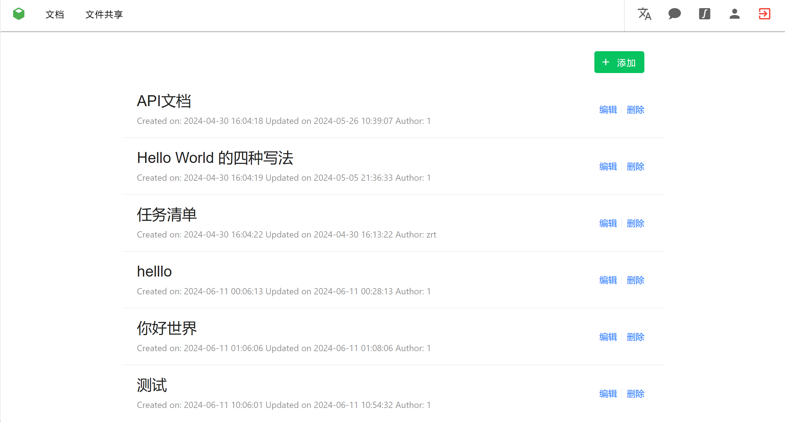
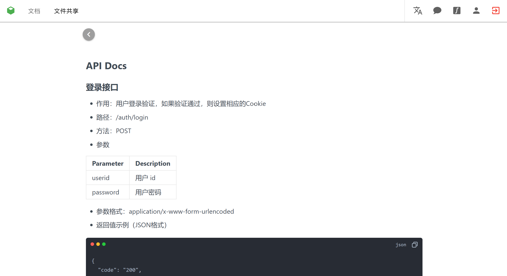
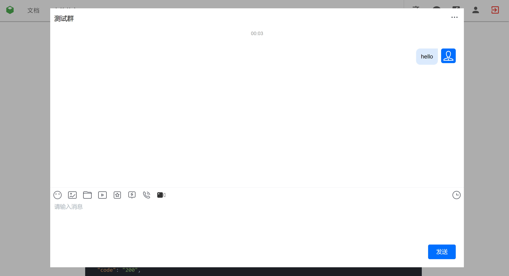
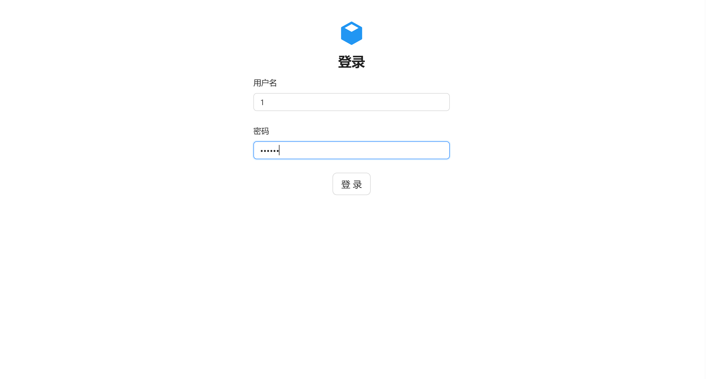
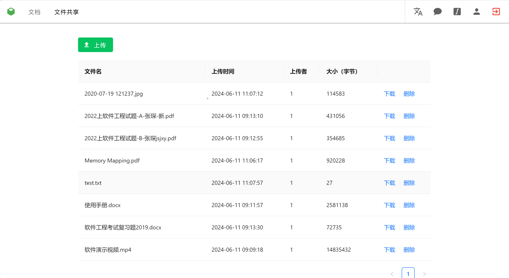

## Introduction

Open Collaboration(协创云 in Chinese) is a web platform that supports online communication, Markdown editing & reading, translation and file storage.

This is the group project for Software Engineering(软件工程) of Xidian University(Spring 2024).

Our group includes Ruitian Zhong, Haoran Xu, Jiahao Li and Wenzhuo Li.

To deploy the server and front end, see the following sections.

If you have any problem, feel free to contact me!

## Demo

### Homepage

### Docs 

### Chat

### Login

### File Storage

