[GitHub link](https://github.com/ruitianzhong/xDB)

xDB is a relational DBMS built upon persistent key-value storag written by [Ruitian Zhong](https://zrt.ink).

## Features

* Expression(nested) evaluation (including `+-*/%^`, `AND/OR`, `... BETWEEN ... AND ...`, `IS NULL`,`IS NOT NULL` on `CHAR` and `INTEGER`)
* SQL comment
* `NOT NULL` column constraint
* Supported Datatype: `INT`, `FLOAT`, `CHAR(N)`
* Multi-line support
* sql file execution(`./xDB --filepath="/path/to/example.sql"`)
* Line editing and sql history
* Select multiple tables(a.k.a., Cartesian product)
* Based on persistent key-value storage(built upon LSM-Tree) like [MyRocks](http://myrocks.io/) and [TiDB](https://docs.pingcap.com/zh/tidb/stable)

More details in `Supported SQL (Example)`.

## Supported SQL (Example)

```sql
CREATE DATABASE example;
USE example;
CREATE TABLE user (id int,score float);
SHOW TABLES;
INSERT INTO user (id int NOT NULL) VALUES (1);
SELECT id from user WHERE id = 42;
UPDATE user SET id=1 WHERE id=42;
DELETE FROM user WHERE id=42;
SELECT * from user where id=(1+2*2+(id=id)+id^id+id) AND id = id%2 AND id IS NOT NULL;
select * from t1  where id is not null;
DROP TABLE user;
```


## Demo

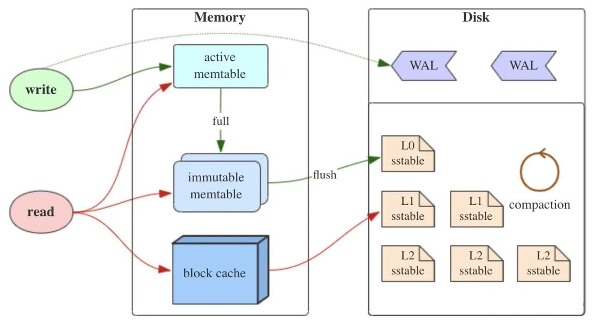
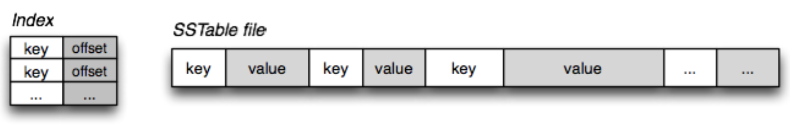
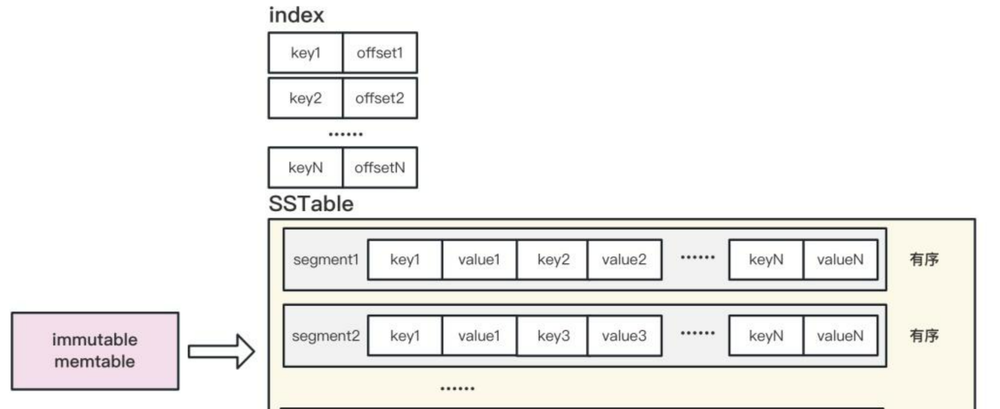
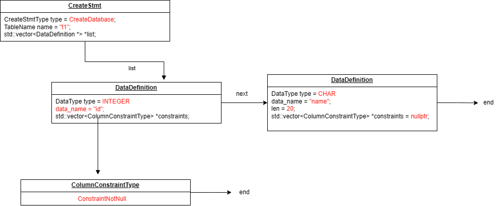
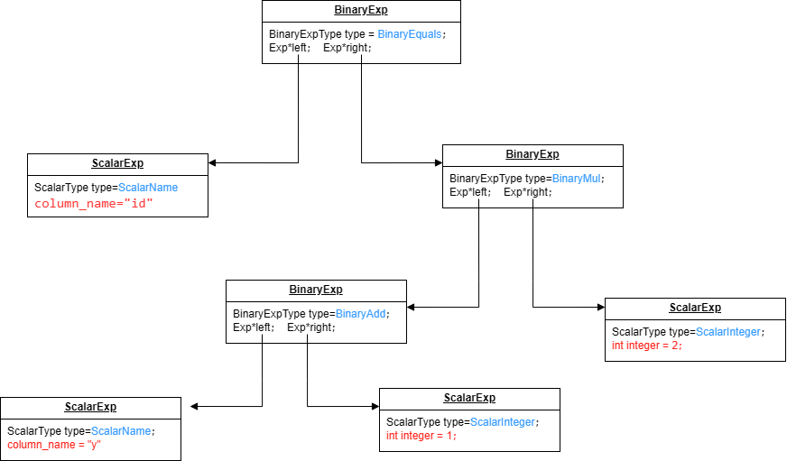
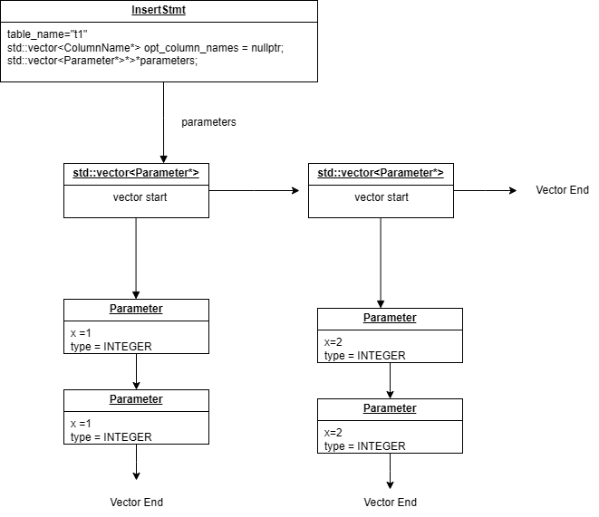
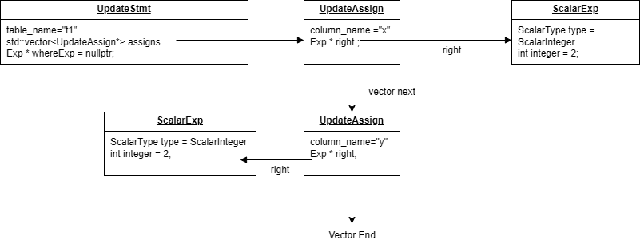
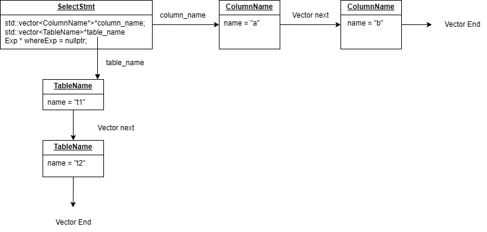
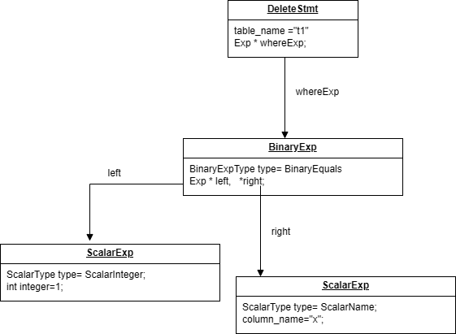
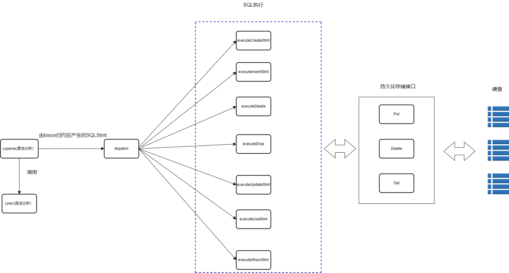
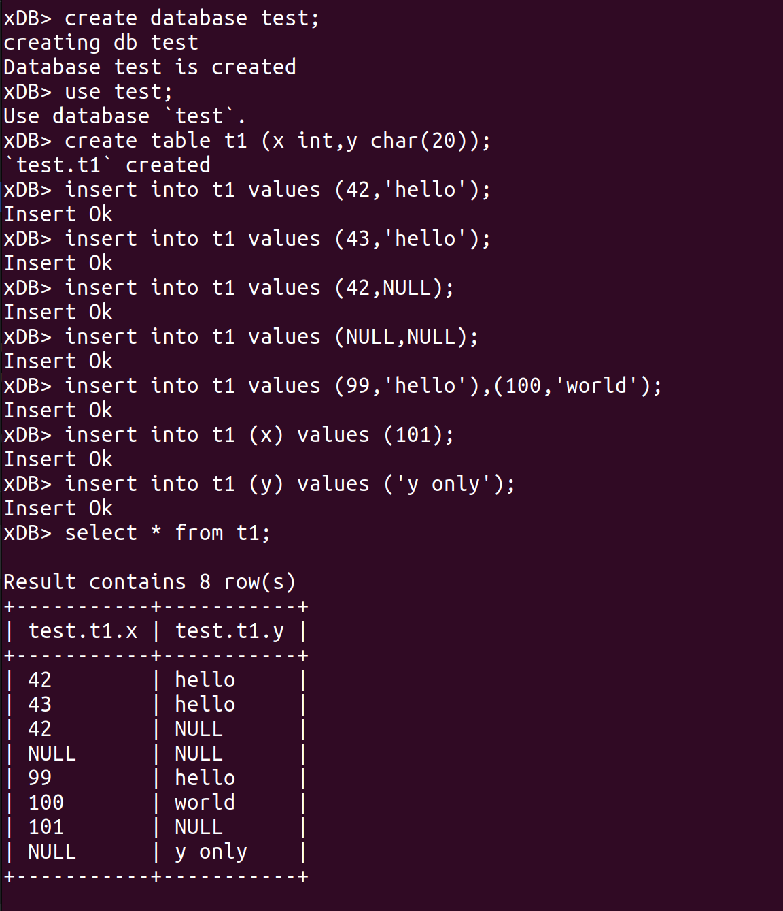
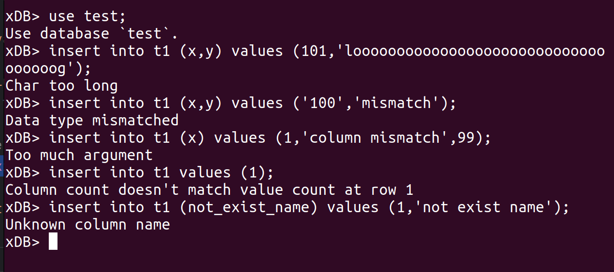
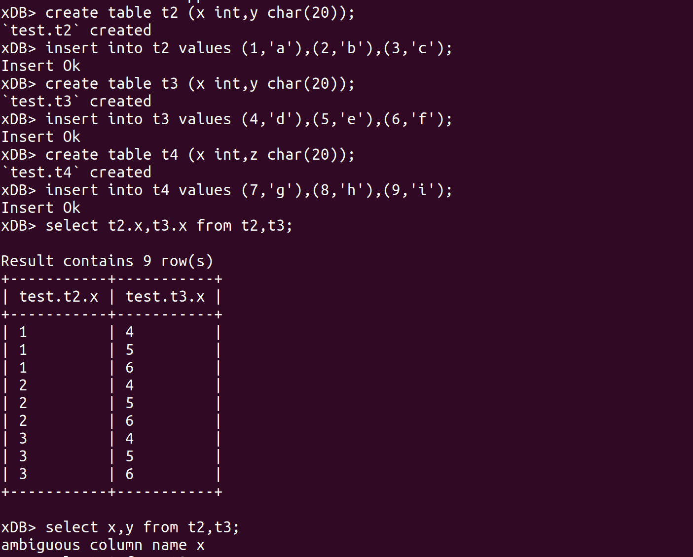
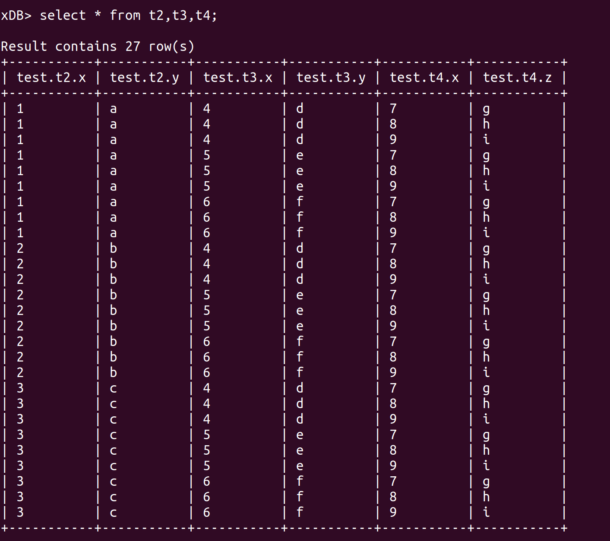
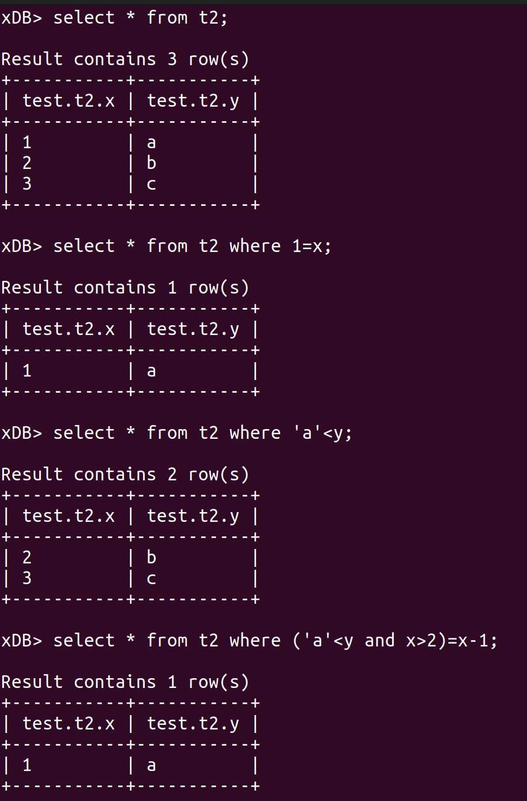
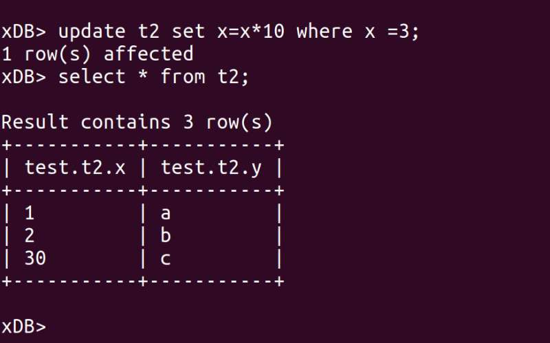
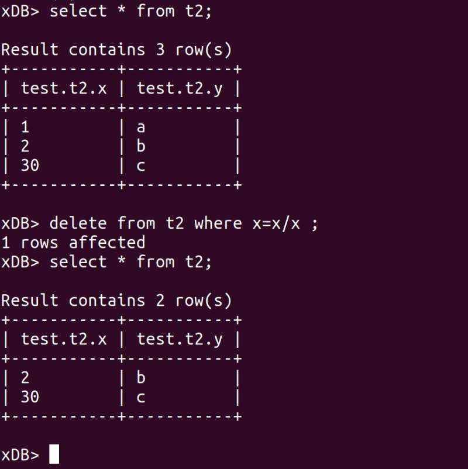
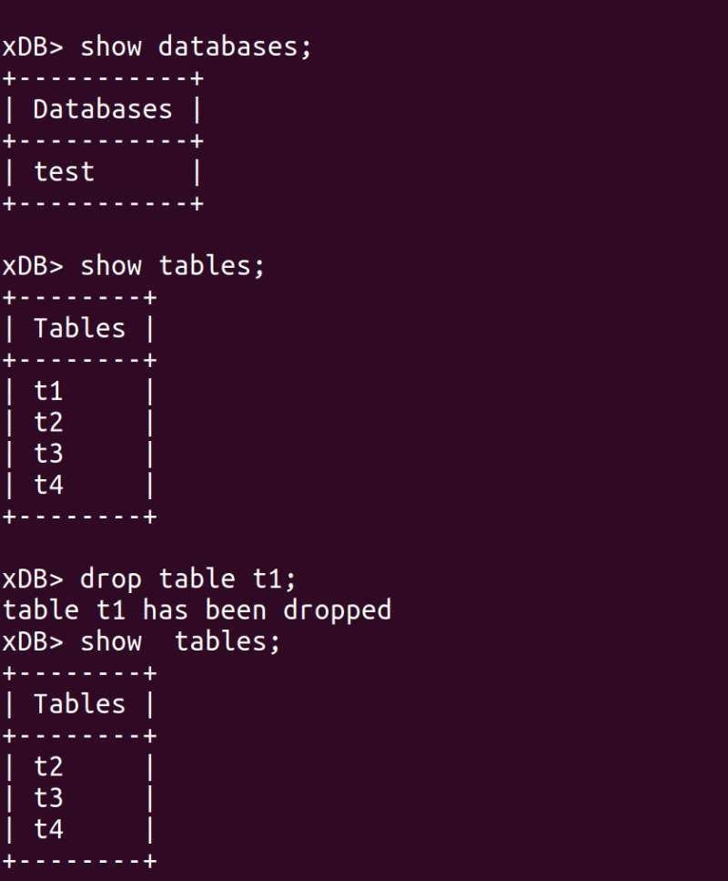