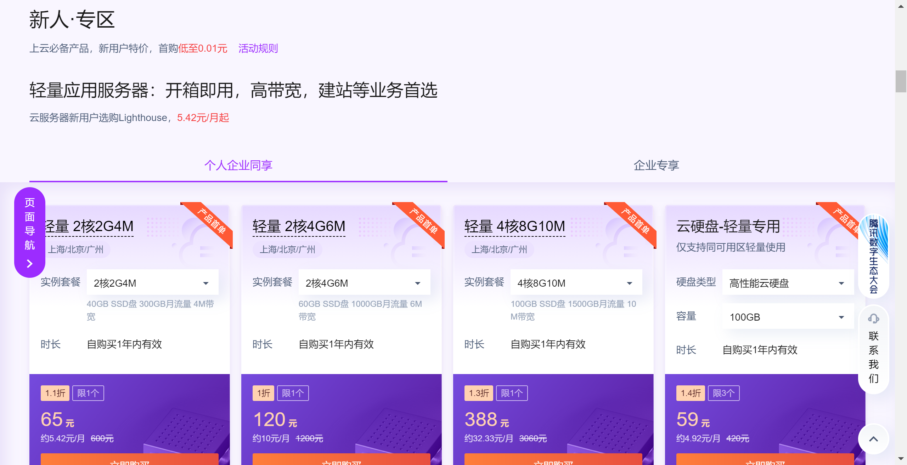
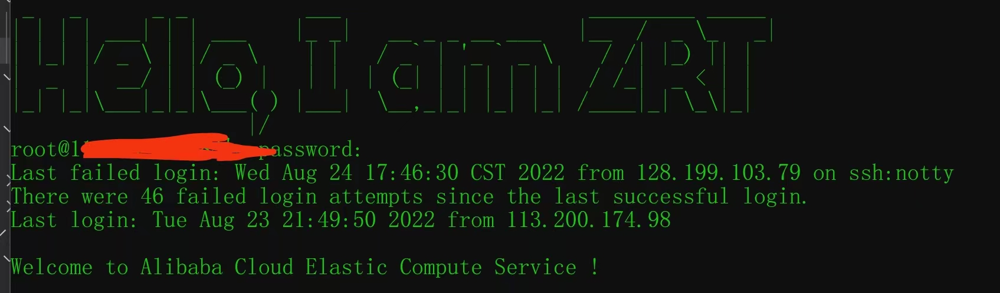
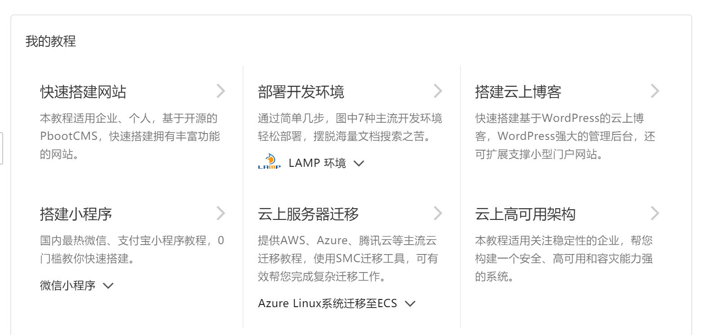
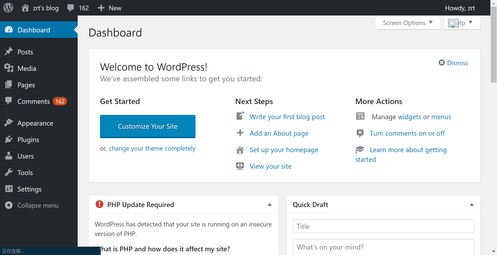
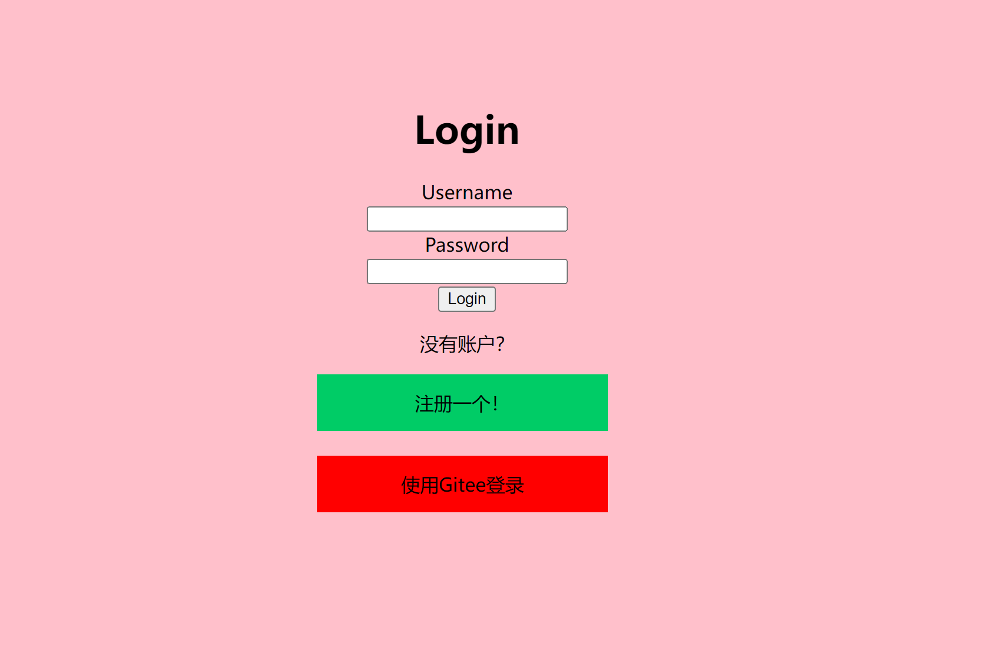

# 云服务器

笔者在2022年2月份的时候趁着便宜租了阿里云的服务器，配置为`1核(vCPU) 2 GiB `，当时续一年需要87元左右，一共续了两年，这个价格一直是浮动的，现在同样配置续期一年需要1234元（2022年8月25日）。当然对于新注册用户而言，有更大力度的优惠，值得一提的是，阿里云，学生有两周ECS服务器免费使用权，若提交试用报告审核成功后还可以续期两个月

[腾讯云](https://cloud.tencent.com/)

[阿里云](https://www.aliyun.com/)

[阿里云学生页面](https://developer.aliyun.com/plan/student?spm=5176.21213303.4134825510.1.2b8853c9Zul9t0&scm=20140722.S_card@@%E5%95%86%E5%93%81@@1624683.S_cardgbdt.ID_card@@%E5%95%86%E5%93%81@@1624683-RL_%E5%AD%A6%E7%94%9F-OR_ser-V_2-P0_0)

在云服务器上建站最好先学习一下Linux命令行，个人认为云服务器可玩性比较强，因为云厂商提供了较为丰富的上手教程，下图为阿里云服务器使用ssh登录的页面：

## Linux + Apache + MySql + PHP（LAMP）

这也是非常常见的``LAMP``架构了，其中Apache是服务器，MySql是数据库，无论是腾讯云还是阿里云都提供了较为详细的安装教程，基本上按照提示复制粘贴就能把所有东西都配置完成，温馨提示：如果一定要使用CentOS，请使用7.x版本，而不是8.x版本，8.x版本按照教程来会出错，出现无法下载的情况，推荐使用其他Linux发行版，如Ubuntu等。

如下图，就是用WordPress搭建的一个网站，WordPress自带DashBoard可以编辑文章，和基于Github Pages的博客相比，学习成本较低，自带用户管理和评论区功能，可以较快上手，同时有一些插件支持Markdown写作。而对于基于Github Pages的博客而言，增加评论区一般要添加其它依赖，较为繁琐

## Java + Spring Boot

**Java**的``Spring Boot``是动态网站常用的框架。*静态网站*上的东西顾名思义是静态的，每个人访问都是一样的结果，比如说某人写的一系列文章，互联网早期大多数网站都是静态网站，而 *动态网站* 则可以根据不同的请求或用户发送的不同请求返回不同的页面，比如说用户的登录界面，甚至说OAuth协议下的第三方登录,基于此可以做出非常灵活和有意思的应用。而WordPress其实既有动态部分也有静态部分。

推荐使用阿里云的Cloud Toolkit将应用程序打成*Jar包*，远程部署，效率实在是高，这个工具在主流的Java IDE中以插件的形式存在。

## 其他

服务器比较其中比较重要的资源就是珍贵的公网IP了，比如说可以作为IM软件（即时通信，如微信）的中继服务器。其实很多应用在本地机就可以运行，如Spring Boot，部署到服务器上除了能够把你的网站或服务开放给别人之外，也迫使你学习部署和运维的一些技巧，个人认为这也是DevOps的精神的一种体现

